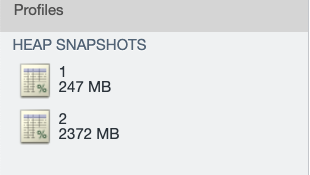

# Node性能问题分析

CPU暴涨、OOM两类是Node中常见的性能问题。针对这两类问题，在Node或者说JS的世界中，都有其分析该类问题的方法，下面就来简单介绍下。

## CPU类问题

针对于这类问题，如果我们知道问题的范围（如：知道是谋几个接口导致），那问题会相对简单，针对已知的接口进行逐一排查就行，若是对项目代码比较熟悉，甚至可以直接缩小范围。若是只知道CPU暴涨，但是无法锁定范围，这类问题一般比较棘手，这也是这里介绍的重点。

针对这类问题，一般是通过火焰图的方式进行分析，要查看火焰图，首先要采集应用的cpu profile数据，下面先介绍下集中采集数据的方法。

- 使用alinode

alinode最好结合阿里云的Node.js性能平台进行使用，这里就不多赘述了，可以直接看官方的文档：[Node.js性能平台](https://www.aliyun.com/product/nodejs)。

-  使用Inspector

我们也可以使用node的核心库：[Inspector](https://nodejs.org/dist/latest-v14.x/docs/api/inspector.html)来采集应用的数据，具体的使用方式如下：

```javascript
const inspector = require('inspector');

const session = new inspector.Session();
session.connect();

async function getCPUProfile() {
  return new Promise((resolve, reject) => {
    session.post('Profiler.enable', () => {
      session.post('Profiler.start', () => {
        setTimeout(() => {
          session.post('Profiler.stop', (err, { profile }) => {
            if (err) {
              reject(err.message);
              return;
            }

            resolve(JSON.stringify(profile));
          });
        }, 10000);
      });
    });
  });
}
```

getCPUProfile方法会采集应用当前的CPU数据，设置的是10s，这里可以根据自己的具体情况自行设置。更多使用方式见：[inspector](https://nodejs.org/dist/latest-v14.x/docs/api/inspector.html)

- 使用V8 Tick Processor

V8也提供了我们进行应用性能分析的工具：Tick Processor，可以记录 JavaScript/C/C++ 代码的堆栈信息，默认情况下是关闭的，我们在启动应用的时候使用参数：--prof开启该功能。

```
node --prof index.js
```

结束应用后，会生成：isolate-0x104b00000-77399-v8.log这样的文件，但是这样的文件我们是比较难读懂的，这时候就要借用--prof-process工具，将log转化为我们可以读懂的数据：

```
node --prof-process isolate-0x104b00000-77399-v8.log
```

这样会打印输出对应的文本，但是我们的终端无法显示全部数据，所以我们将数据保存到文本：

```
node --prof-process isolate-0x104b00000-77399-v8.log > log.txt
```

打开log.txt，会看到下面的几类数据：

```
 [Shared libraries]:
   ticks  total  nonlib   name
   2355    9.1% 	 /usr/lib/system/libsystem_malloc.dylib
    715    2.7% 	 /usr/lib/system/libsystem_platform.dylib
    251    1.0% 	 /usr/lib/system/libsystem_kernel.dylib
    161    0.6% 	 /usr/lib/system/libsystem_pthread.dylib
     61    0.2% 	 /usr/lib/libc++abi.dylib
     51    0.2% 	 /usr/lib/system/libsystem_c.dylib
     37    0.1% 	 /usr/lib/libc++.1.dylib
      5    0.0% 	 /usr/lib/system/libsystem_m.dylib
      2    0.0% 	 /usr/lib/system/libdyld.dylib
 [JavaScript]:
   ticks  total  nonlib   name
     47    0.2%    0.2%  LazyCompile: *emitHook internal/async_hooks.js:230:18
     ......
 [C++]:
   ticks  total  nonlib   name
  14893   57.2%   66.5%  t __ZN2v88internal23CallInterfaceDescriptor29InitializePlatformIndependentEPNS0_27CallInterfaceDescriptorDataE
    746    2.9%    3.3%  T _host_get_clock_service
    520    2.0%    2.3%  T __kernelrpc_vm_remap
    ......
 [Summary]:
   ticks  total  nonlib   name
   1822    7.0%    8.1%  JavaScript
  20442   78.6%   91.3%  C++
   1027    3.9%    4.6%  GC
   3638   14.0% 	 Shared libraries
    115    0.4% 	 Unaccounted
 [C++ entry points]:
   ticks    cpp   total   name
  12653   59.4%   48.6%  t __ZN2v88internal23CallInterfaceDescriptor29InitializePlatformIndependentEPNS0_27CallInterfaceDescriptorDataE
   4378   20.5%   16.8%  T __ZN2v88internal35Builtin_DatePrototypeToLocaleStringEiPmPNS0_7IsolateE
   2136   10.0%    8.2%  T __ZN2v88internal21Builtin_HandleApiCallEiPmPNS0_7IsolateE
    515    2.4%    2.0%  T __kernelrpc_vm_remap
    ......
 [Bottom up (heavy) profile]:
  Note: percentage shows a share of a particular caller in the total
  amount of its parent calls.
  Callers occupying less than 1.0% are not shown.

   ticks parent  name
  14893   57.2%  t __ZN2v88internal23CallInterfaceDescriptor29InitializePlatformIndependentEPNS0_27CallInterfaceDescriptorDataE
   4367   29.3%    t __ZN2v88internal23CallInterfaceDescriptor29InitializePlatformIndependentEPNS0_27CallInterfaceDescriptorDataE
   ......
```

[JavaScript] 部分列出了 JavaScript 代码执行所占用的 CPU ticks（CPU 时钟周期），[C++] 部分列出了 C++ 代码执行所占用的 CPU ticks，[Summary] 列出了各个部分的占比，[Bottom up] 列出了所有 CPU 占用时间从大到小的函数及堆栈信息，小于 1% 的则不予显示。

上面的方法都是当你无法定位代码中具体是什么原因造成CPU暴涨时的分析方法，也就是实在是没有办法了才会使用。

一般情况下，我们只要定位到接口、方法层面就很好解决问题了，所以应用到监控数据在这个时候就很重要了（应用的QPS、每个接口的调用量、RT等指标），有了应用的监控数据，我们可以很快的定位到异常的接口，针对性的进行问题排查，能大大的提升我们解决问题的速度。

### 怎样读懂火焰图

这里推荐阮一峰的博客：[如何读懂火焰图？](https://www.ruanyifeng.com/blog/2017/09/flame-graph.html)

### 总结

对于应用CPU类问题的定位，首先是要缩小问题的范围，通过接口、方法的QPS、RT等监控数据，锁定存在问题的接口，然后在此范围内分析代码的实现细节，这是解决CPU类问题的最佳实践（个人总结的，仅供参考）。当你无法缩小范围，或者无法确定是哪里出现了问题的时候，上面介绍的几种方法可以帮助你分析Node应用的CPU类问题。

## 内存泄漏问题

对于OOM的问题就没有很多的方法了，基本都是采集应用的heapdump数据，然后分析。这里使用Google提供的devtool工具即可。使用Google的devtool分析内存快照的方法见：[使用 chrome-devtools Memory 面板](https://zhuanlan.zhihu.com/p/80792297)。

这里主要分享下分析内存快照的方法。

在分析内存泄漏的问题是，我们需要准备多份快照文件（至少两份），在不同的时间采集应用的内存快照，然后load到google的工具：

首先，我们要确定哪些对象存在内存泄漏，选中一个文件，使用Memory面板的comparison功能：

这里是按照size delta的数量进行排序的，基本上这里的前几项都是存在问题。接下来，我们看下怎么分析这里的一个对象。这里的对象都是可以展开的，可以看到里面的一些具体的数据，这里介绍几个在定位问题时比较有用的属性。

- context
  - context中有当前对象的执行上下文，里面有很多有用的数据
- scope_info
  - 这里会有当前对象的关联信息，比如调用方信息，对定位问题的帮助很大

通过context和scope_info的数据可以定位到代码执行的一些上下文信息，可以帮助我们很好的锁定到代码的范围，最后要做的还是根据快照提供的数据具体的分析代码，最好才能真正的定位内存泄漏的原因并修复问题。

